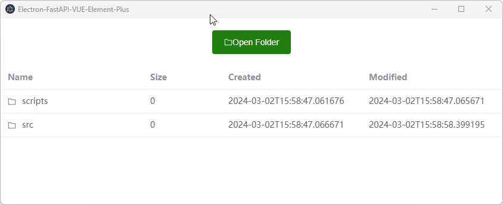

# Electron-FastAPI-Vue-Element-Plus

This repository provides a boilerplate to integrate Electron, FastAPI, Vue, and Element Plus. The example code in this repository demonstrates opening a folder, passing the file path to FastAPI backend via HTTP, FastAPI reading the files information in the directory, and then returning it to the frontend. The frontend uses Vue and Element Plus UI to display the information.



## Features

- Electron: Build cross-platform desktop applications with web technologies
- FastAPI: A modern, fast (high-performance), web framework for building APIs with Python
- Vue: A progressive JavaScript framework for building user interfaces
- Element Plus: A Vue 3.0 UI library that helps to create modern web applications

## Prerequisites

- Node.js installed 
- Python installed

## Getting Started

1. Clone this repository

```
git clone https://github.com/your-username/electron-fastapi-vue-element-plus.git
```

2. Install dependencies for the Vue, Element Plus

```
cd src/frontend
npm install
```

3. Install dependencies for the FastAPI
```
cd src/backend
pip install -r requirements.txt
```

4. Install dependencies for the Electron from the root of this project
```
npm install
```

5. Run the development mode from the root of this project

```
npm run dev
```

6. Build the distribution from the root of this project

```
npm run build
```

## Repo Structure
```
  ├─┬ scripts         
  │ ├─┬ private      
  │ │ └── tsc.js          script for compile typescript
  │ ├── build.js          script for build
  │ └── dev-server.js     script for dev-server
  │
  ├─┬ src
  │ ├── backend           fastapi + uvicorn
  │ ├── electron          electron
  │ └── frontend          vue + element plus + vite
  │
  ├── package.json
  └── electron-builder.json
```

## Credits
The [scripts](scripts) source code in this project is borrowed from [Deluze/electron-vue-template](https://github.com/Deluze/electron-vue-template).

## License

This project is licensed under the MIT License - see the [LICENSE](LICENSE.txt) file for details.